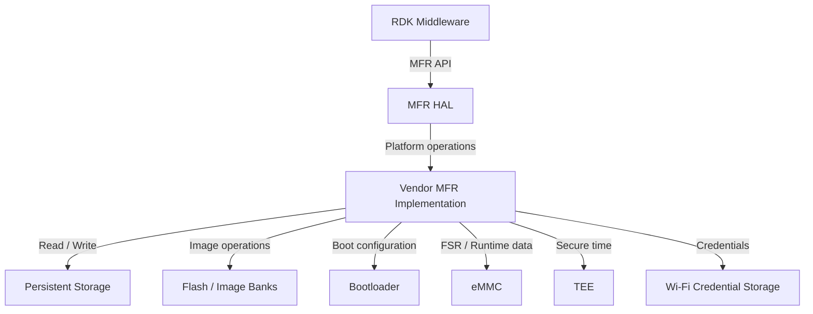
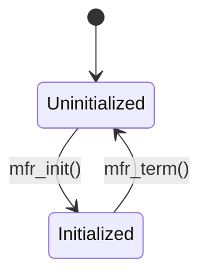
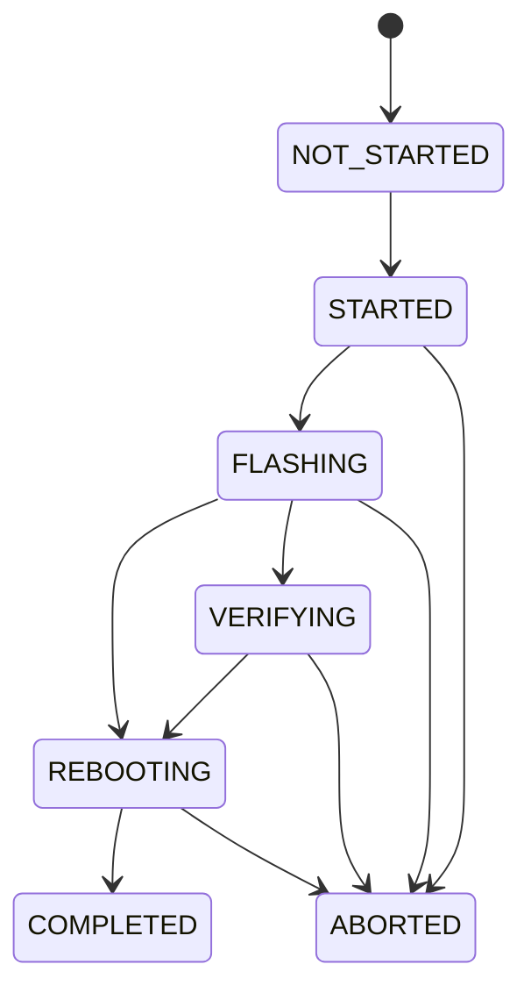
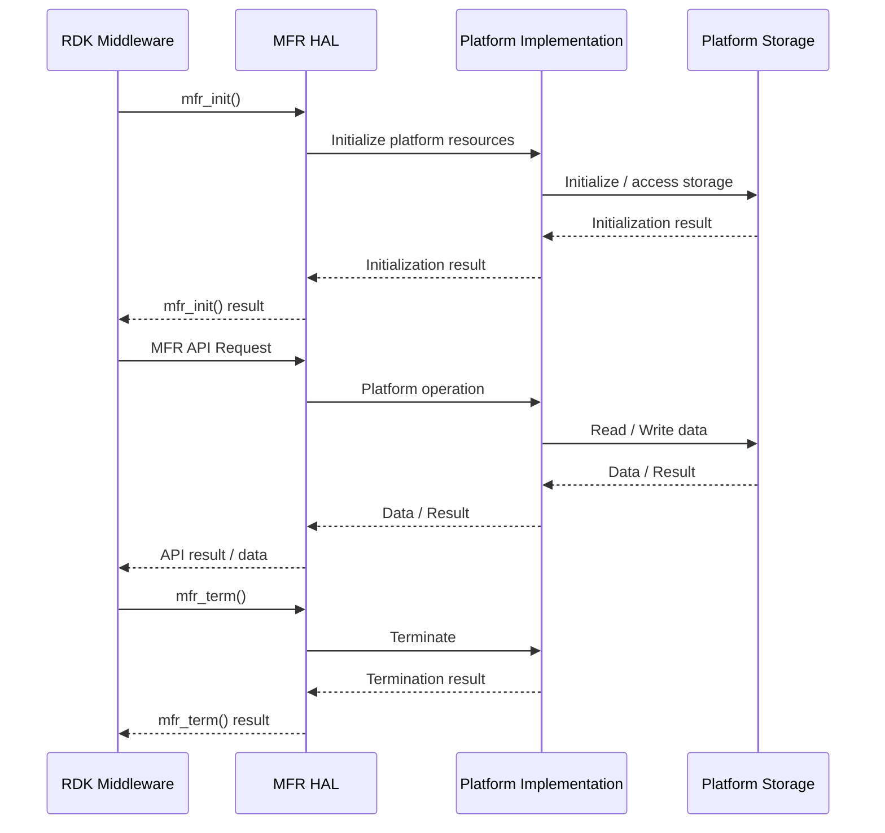
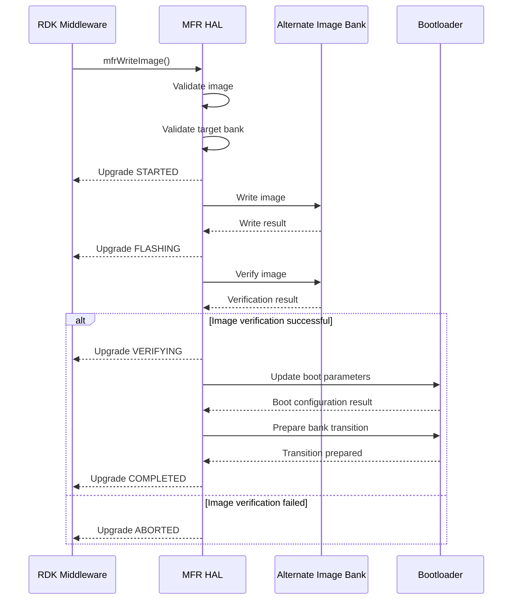
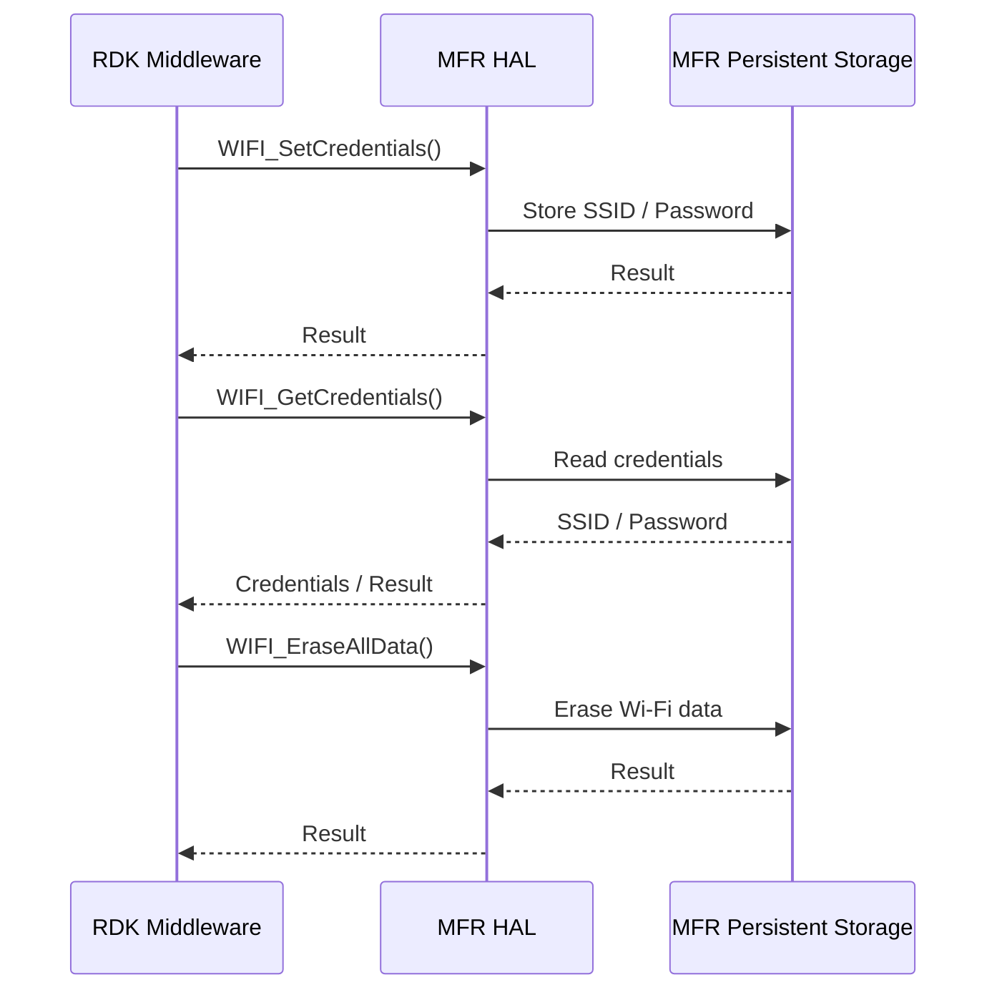
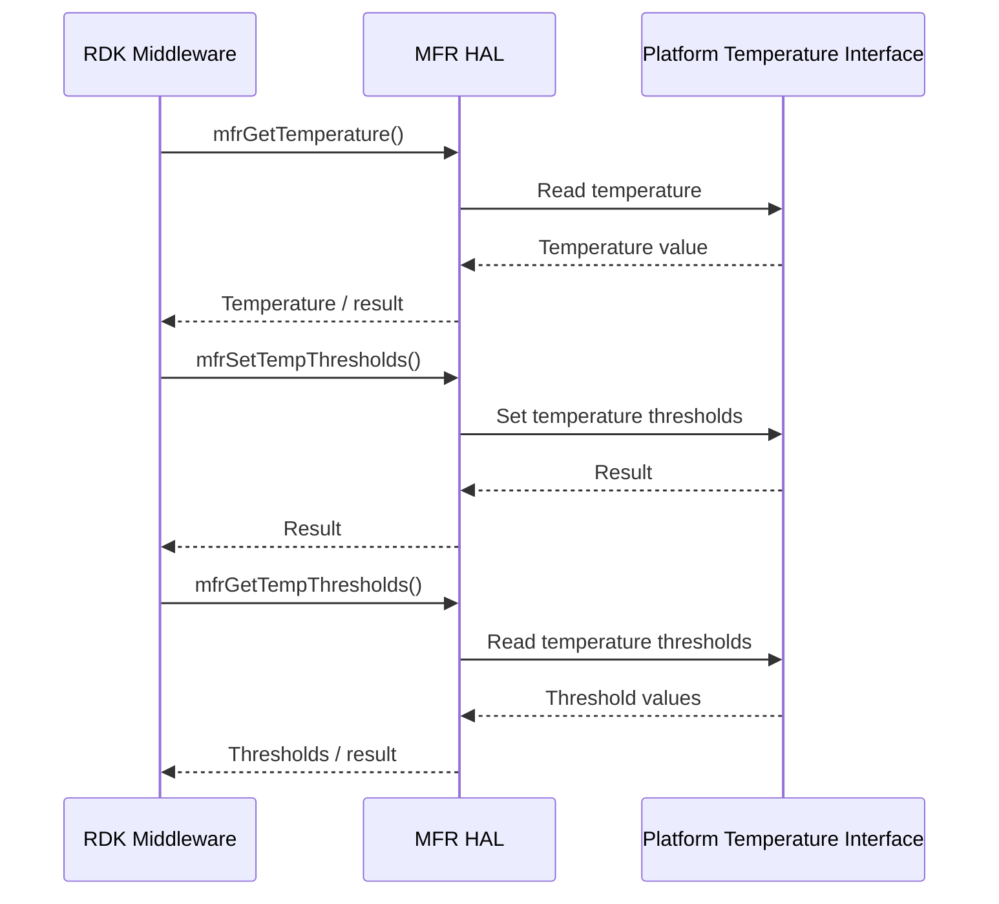
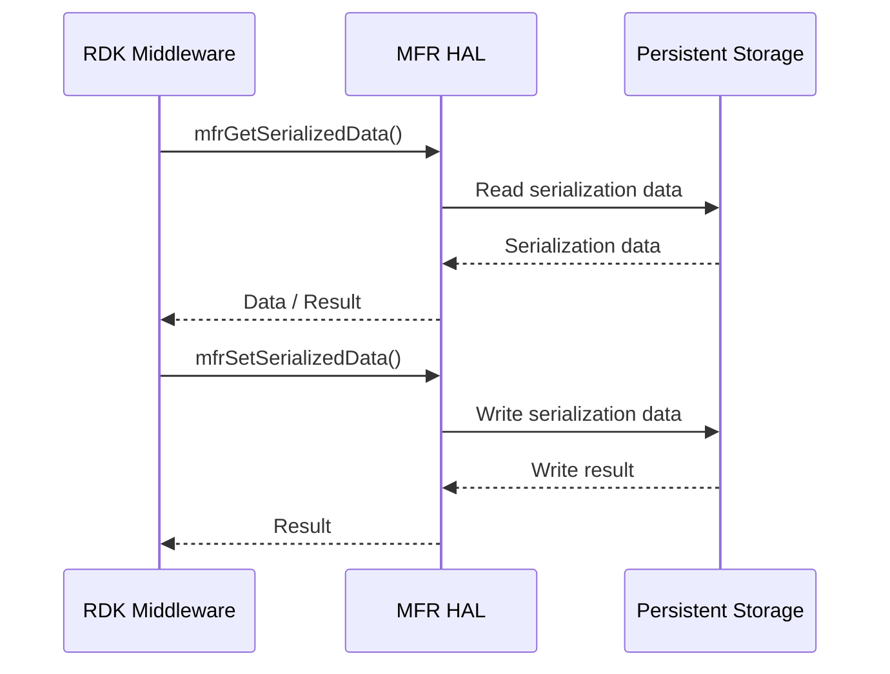
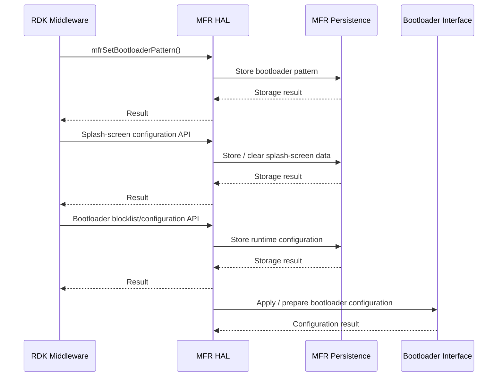

# MFR HAL Documentation

## Overview

The Manufacturer (MFR) HAL provides a platform-independent interface for
manufacturer/device serialization data, firmware image operations, bootloader
configuration, secure time, FSR/configuration data, and Wi-Fi credentials.

The MFR HAL abstracts platform-specific persistent storage, flash/image banks,
bootloader, eMMC, TEE, and Wi-Fi credential storage from RDK Middleware.

## Scope

This specification defines the common MFR HAL behavior, including:

- MFR lifecycle
- Device serialization data
- Firmware image operations
- Image upgrade status
- PDRI management
- Image-bank scrubbing
- Bootloader pattern and splash-screen configuration
- Secure UTC time
- FSR flag management
- Bootloader runtime configuration
- Wi-Fi credential persistence

Platform-specific implementations may return the documented unsupported
operation status when a capability is not available.

 ## Vendor layer Responsibilities

 The vendor implementation is responsible for:

 | Area | Responsibility |
| --- | --- |
| Initialization | Initialize all internal components required by MFR. |
| Serialization | Provide platform-specific persistent serialization storage. |
| Flash | Provide platform-specific flash access and verification. |
| Image upgrade | Implement alternate-bank image upgrades. |
| Bootloader | Provide boot-parameter and bootloader integration. |
| PDRI | Provide PDRI deletion where supported. |
| Image scrubbing | Remove platform images from the defined banks. |
| Splash screen | Store and clear bootloader splash-screen data. |
| Secure time | Interface with the platform TEE secure-time implementation. |
| FSR | Read/write the platform FSR location. |
| Configuration | Read/write bootloader runtime blocklist data. |
| Wi-Fi | Read/write/erase Wi-Fi credentials in MFR persistence. |
| Error handling | Return the documented MFR/Wi-Fi error codes. |
| Concurrency | Preserve the documented thread-safety contract. |
| Power state | Preserve image upgrade state across DEEPSLEEP/wakeup. |

## Acronyms, Terms and Abbreviations

| Term | Description |
| --- | --- |
| HAL | Hardware Abstraction Layer |
| API | Application Programming Interface |
| MFR | Manufacturer |
| PDRI | Peripheral Disaster Recovery Image |
| DRI | Disaster Recovery Image |
| FSR | Factory/System Reset flag |
| TEE | Trusted Execution Environment |
| CRC | Cyclic Redundancy Check |
| SVN | Software Version Number |
| OUI | Organizationally Unique Identifier |
| eMMC | Embedded MultiMediaCard |
| Wi-Fi | Wireless Fidelity |

## Description

`MFR` interface provides `APIs` that can interface with other interfaces in order to persist the data required for their operational needs. These `APIs` are used by various system components which are not limited to the below ones and can be persisted through the interfaces provided in `MFR`.

`MFR` can provide following major functionalities:
 - Read/write serialization data including manufacturer, model name, product class, hardware/software versions, etc.
 - Read/write data from/to secure `NVRAM`, including `DTCP` certificates.
 - Read/write data from/to non-secure `NVRAM`, including boot image information.
 - Flash memory operations for `STB` image upgrade this includes capability to clear and update the respective flash area
 - Perform a `CRC` check after flashing the image to the `NVRAM` partition and write the `CRC` to a partition in `NVRAM`
 - Get current firmware upgrade status.
 - Measure the cabinet temperature data.
 - Set and get the temperature thresholds.
 - Read, write and erase `WIFI` credentials.

The `HAL` implementation is largely specific to the device/`OEM`.

This interface should be scalable, extensible and maintainable.

## Functional Overview

The MFR HAL provides the following functional areas:

- Serialization data read/write
- Firmware image flashing and verification
- Image upgrade progress notification
- PDRI deletion and image-bank scrubbing
- Bootloader pattern and splash-screen configuration
- Secure UTC time access
- FSR flag access
- Bootloader runtime configuration
- Wi-Fi credential persistence

## Interface Definitions

### Implementation Requirements

| Requirement | Description |
| --- | --- |
| HAL.MFR.1 | The implementation shall provide the supported MFR HAL APIs defined by the public headers. |
| HAL.MFR.2 | APIs requiring initialization shall only be used after `mfr_init()`. |
| HAL.MFR.3 | The implementation shall return the documented MFR/Wi-Fi status codes. |
| HAL.MFR.4 | Serialized data shall be handled according to the `mfrSerializedData_t` contract. |
| HAL.MFR.5 | Firmware upgrades shall use the alternate image bank. |
| HAL.MFR.6 | The current image bank shall not be disturbed during an upgrade. |
| HAL.MFR.7 | APIs documented as not thread safe shall be serialized by the caller. |
| HAL.MFR.8 | Image-write state shall be recoverable across the documented DEEPSLEEP/wakeup transition. |

### Initialization

### Initialization

As part of the vendor layer initialization, the MFR interface shall be
initialized through `mfr_init()`.

The implementation shall initialize the internal components required to
support the MFR APIs.

Upon successful initialization, the MFR interface shall become operational
and ready to service MFR API requests.

If the MFR interface is already initialized, `mfr_init()` shall return
`mfrERR_ALREADY_INITIALIZED`.

### System Context

The MFR HAL provides an abstraction between RDK Middleware and the vendor-specific platform implementation.

The vendor implementation is responsible for interfacing with platform components such as persistent storage, flash/image banks, bootloader, eMMC, TEE, and Wi-Fi credential storage.

RDK Middleware interacts only with the MFR HAL APIs and does not directly access these platform components.

### Resource Management

### Resource Management

The MFR HAL does not expose resource handles to the caller. The implementation
may internally use resources such as persistent storage, flash, eMMC,
bootloader interfaces, TEE services, or other platform-specific resources.

These resources shall be managed internally by the MFR implementation.
Resource acquisition, usage, and cleanup shall be handled by the
implementation as required by the supported MFR APIs.

No explicit resource acquisition or release API is defined by the MFR HAL.

### Operation and Data Flow

#### Serialization

1. Caller requests a serialization type.
2. MFR HAL accesses platform persistence.
3. Serialized data is returned as a byte stream.
4. Caller interprets the data according to the requested serialization type.

#### Image Upgrade

1. Caller requests an image upgrade.
2. MFR validates the image and target.
3. Boot parameters are updated as required.
4. The alternate image bank is selected.
5. The image is written and verified.
6. Upgrade progress is reported through the optional callback.
7. The operation completes or is reported as aborted.

#### Wi-Fi Credentials

1. Caller requests Wi-Fi credential read/write/erase.
2. MFR accesses platform credential persistence.
3. The operation result is returned through `WIFI_API_RESULT`.

### Modes of Operation

 No distinct operational modes are defined by the MFR HAL.

 Platform implementations may restrict individual capabilities depending on\
 platform support or build configuration.

 ### Event Handling

 The MFR HAL does not define a general event/listener mechanism.

 Image upgrade progress may be reported through\
 `mfrUpgradeStatusNotify_t`.

 The callback reports upgrade progress and the final `COMPLETED` or `ABORTED`\
 state.

## State Machine / Lifecycle

The MFR HAL has an initialization lifecycle:

 Image upgrades maintain an independent progress state:

## Data Format / Protocol Support

The MFR HAL supports the data formats and types defined by the public MFR
HAL headers.

### Serialization Types

| Enum | Description |
| --- | --- |
| `mfrSERIALIZED_TYPE_MANUFACTURER` | Manufacturer |
| `mfrSERIALIZED_TYPE_MANUFACTUREROUI` | Manufacturer OUI |
| `mfrSERIALIZED_TYPE_MODELNAME` | Model name |
| `mfrSERIALIZED_TYPE_DESCRIPTION` | Device description |
| `mfrSERIALIZED_TYPE_PRODUCTCLASS` | Product class |
| `mfrSERIALIZED_TYPE_SERIALNUMBER` | Serial number |
| `mfrSERIALIZED_TYPE_HARDWAREVERSION` | Hardware version |
| `mfrSERIALIZED_TYPE_SOFTWAREVERSION` | Software version |
| `mfrSERIALIZED_TYPE_PROVISIONINGCODE` | Provisioning code |
| `mfrSERIALIZED_TYPE_FIRSTUSEDATE` | First-use date |
| `mfrSERIALIZED_TYPE_DEVICEMAC` | Device MAC address |
| `mfrSERIALIZED_TYPE_MOCAMAC` | MoCA MAC address |
| `mfrSERIALIZED_TYPE_HDMIHDCP` | HDMI HDCP data |
| `mfrSERIALIZED_TYPE_PDRIVERSION` | Primary DRI version |
| `mfrSERIALIZED_TYPE_WIFIMAC` | Wi-Fi MAC address |
| `mfrSERIALIZED_TYPE_BLUETOOTHMAC` | Bluetooth MAC address |
| `mfrSERIALIZED_TYPE_WPSPIN` | WPS PIN |
| `mfrSERIALIZED_TYPE_ETHERNETMAC` | Ethernet MAC address |
| `mfrSERIALIZED_TYPE_ESTBMAC` | eSTB MAC address |
| `mfrSERIALIZED_TYPE_RF4CEMAC` | RF4CE MAC address |
| `mfrSERIALIZED_TYPE_PMI` | Product manufacturer information |
| `mfrSERIALIZED_TYPE_HWID` | Hardware ID |
| `mfrSERIALIZED_TYPE_MODELNUMBER` | Model number |
| `mfrSERIALIZED_TYPE_SOC_ID` | SoC ID |
| `mfrSERIALIZED_TYPE_IMAGENAME` | Flashed image name |
| `mfrSERIALIZED_TYPE_IMAGETYPE` | Image type |
| `mfrSERIALIZED_TYPE_BLVERSION` | Bootloader version |
| `mfrSERIALIZED_TYPE_REGION` | Region |
| `mfrSERIALIZED_TYPE_BDRIVERSION` | Backup DRI version |
| `mfrSERIALIZED_TYPE_LED_WHITE_LEVEL` | LED white level |
| `mfrSERIALIZED_TYPE_LED_PATTERN` | LED pattern |

Panel-specific serialization types are available when
`PANEL_SERIALIZATION_TYPES` is enabled.

### Image Types

| Enum | Description |
| --- | --- |
| `mfrIMAGE_TYPE_CDL` | CDL image |
| `mfrIMAGE_TYPE_RCDL` | RCDL image |
| `mfrUPGRADE_IMAGE_MONOLITHIC` | Monolithic image |
| `mfrUPGRADE_IMAGE_PACKAGEHEADER` | Package-header image |

### Upgrade Progress

| Enum | Description |
| --- | --- |
| `mfrUPGRADE_PROGRESS_NOT_STARTED` | Upgrade not started |
| `mfrUPGRADE_PROGRESS_STARTED` | Upgrade started |
| `mfrUPGRADE_PROGRESS_ABORTED` | Upgrade aborted |
| `mfrUPGRADE_PROGRESS_VERIFYING` | Image verification |
| `mfrUPGRADE_PROGRESS_FLASHING` | Image flashing |
| `mfrUPGRADE_PROGRESS_REBOOTING` | Image upgrade has completed and the platform is preparing for the bank transition/reboot |
| `mfrUPGRADE_PROGRESS_COMPLETED` | Upgrade completed |

### Bootloader Patterns

| Enum | Description |
| --- | --- |
| `mfrBL_PATTERN_NORMAL` | Normal bootloader pattern |
| `mfrBL_PATTERN_SILENT` | Silent bootloader pattern |
| `mfrBL_PATTERN_SILENT_LED_ON` | Silent pattern with LED enabled |
| `mfrBL_PATTERN_LOGO_DISABLED` | Logo disabled |

### Wi-Fi Data Types

| Enum | Description |
| --- | --- |
| `WIFI_DATA_UNKNOWN` | Unknown data type |
| `WIFI_DATA_SSID` | SSID |
| `WIFI_DATA_PASSWORD` | Password |

The authoritative enum definitions and values are provided by `mfrTypes.h`
and `mfr_wifi_types.h`. Enum ordering and values that form part of the
interface contract SHALL remain unchanged.

###  Operational Sequence

The Operational Sequence describes the normal lifecycle of the MFR HAL, from initialization through API operation to termination.

#### Image Upgrade Sequence

The Image Upgrade Sequence describes writing and verifying a firmware image in the alternate image bank and preparing the system for the bank transition.

#### Wi-Fi Credential Sequence

The Wi-Fi Credential Sequence describes storing, retrieving, and erasing Wi-Fi credentials through MFR persistent storage.

#### Temperature Management Sequence

The Temperature Management Sequence describes retrieving the current platform
temperature and managing the configured temperature thresholds.

#### Serialization Data Sequence

The Serialization Data Sequence describes reading and writing manufacturer and device-specific serialization data through MFR persistent storage.

#### Bootloader Configuration Sequence

The Bootloader Configuration Sequence describes the configuration of
bootloader-related parameters through the MFR HAL.

### Error Handling

 The implementation shall return the documented error for each detected\
 condition.

 | Category | Error |
| --- | --- |
| Initialization | `mfrERR_NOT_INITIALIZED` |
| Invalid parameter | `mfrERR_INVALID_PARAM` |
| Memory | `mfrERR_MEMORY_EXHAUSTED` |
| Flash read | `mfrERR_FLASH_READ_FAILED` |
| Flash write | `mfrERR_WRITE_FLASH_FAILED` |
| Flash verification | `mfrERR_FLASH_VERIFY_FAILED` |
| CRC | `mfrERR_FAILED_CRC_CHECK` |
| Invalid image | `mfrERR_BAD_IMAGE_HEADER` |
| Invalid signature | `mfrERR_IMPROPER_SIGNATURE` |
| Image too large | `mfrERR_IMAGE_TOO_BIG` |
| Invalid signing time | `mfrERR_FAILED_INVALID_SIGNING_TIME` |
| Older SVN | `mfrERR_FAILED_IMAGE_SVN_OLDER` |
| Older signing time | `mfrERR_FAILED_IMAGE_SIGNING_TIME_OLDER` |
| Image file | `mfrERR_IMAGE_FILE_OPEN_FAILED` |
